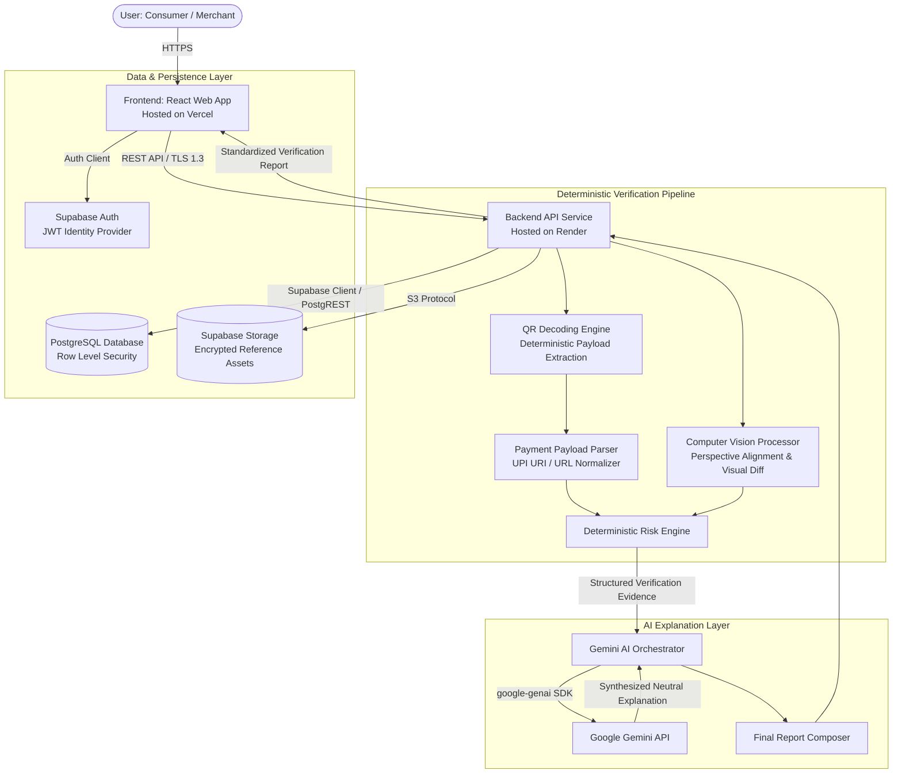
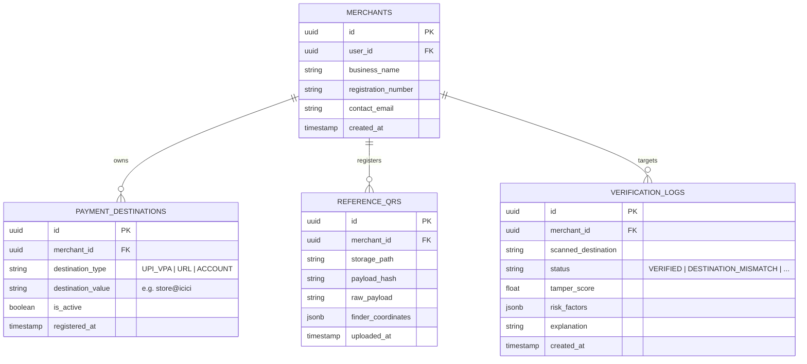
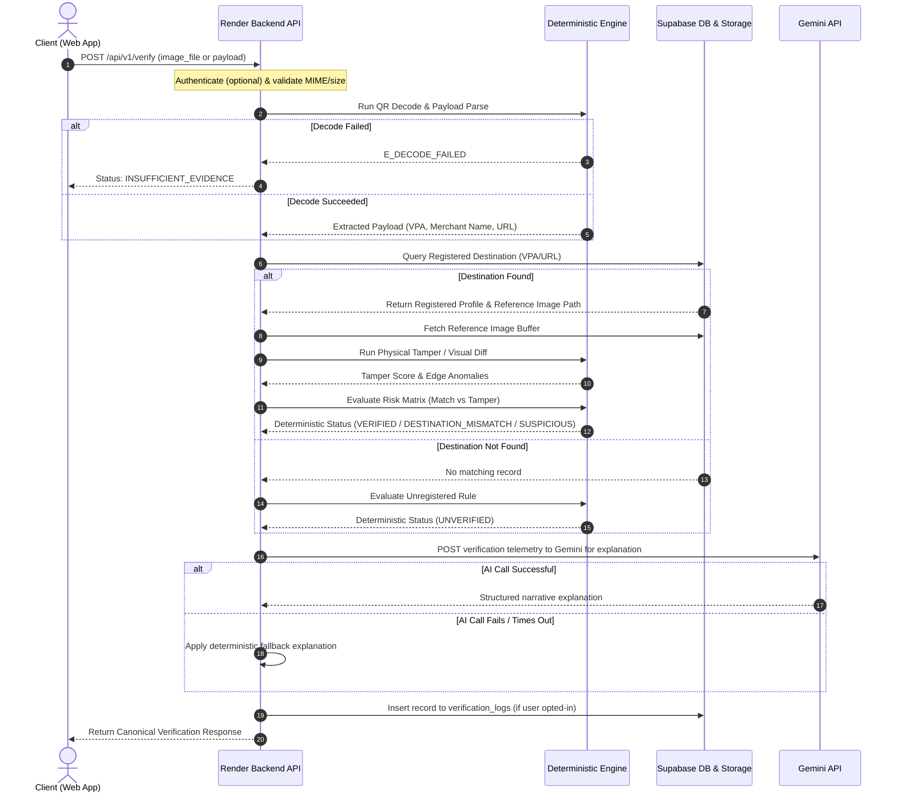
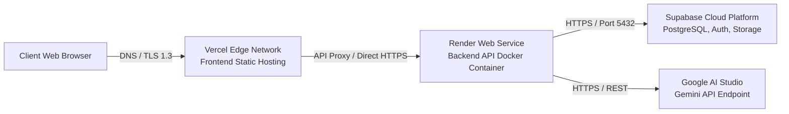

# System Architecture: QRShield AI

Status: DRAFT  
Last Updated: 2026-10-04  
Owner: QRShield Project  

---

## 1. System Overview

QRShield AI is architected as a decoupled, multi-tier cloud application designed for deterministic payment verification, visual tamper detection, and explainable risk reporting. 

The architecture strictly decouples **deterministic verification logic** (mathematical decoding, database lookup, string matching, and image difference calculation) from **generative AI processing** (synthesized human-readable risk narratives and ambiguous visual interpretation).

---

## 2. Component Specifications

### 2.1 Frontend Tier
- **Technology**: Modern React-based single-page application (React 18+ / Vite or Next.js SPA).
  > *TBD — architecture decision required before implementation*: Select between Vite SPA + React Router vs. Next.js App Router during Phase 0 foundation setup.
- **Hosting**: Vercel (Edge CDN, SSL termination, automated CI/CD).
- **Core Responsibilities**:
  - Device camera access via WebRTC `getUserMedia()` with responsive viewfinder overlays.
  - File drag-and-drop ingestion with client-side image compression and format validation (`image/jpeg`, `image/png`, `image/webp`).
  - Rendering of the canonical verification report (Status badge, payload breakdown, expected vs actual diff, visual anomaly viewer, and plain-language explanation).
  - Merchant administration portal (registration, destination management, reference image upload).
  - Sample Lab interactive test harness.

### 2.2 Backend API Tier
- **Hosting**: Render (Managed Web Service, Linux container, health checks).
- **Technology Stack**:
  > *TBD — architecture decision required before implementation*: Evaluate **Python (FastAPI + OpenCV + pyzbar)** vs. **Node.js (TypeScript + Express/Fastify + Sharp + jsQR)**. 
  > - *FastAPI advantage*: Native numerical computing for image alignment, SSIM, and edge detection.
  > - *TypeScript advantage*: Shared types across frontend and backend monorepo.
- **Core Responsibilities**:
  - Expose versioned REST endpoints (`/api/v1/*`).
  - Enforce payload size limits (10 MB maximum) and MIME-type integrity.
  - Deterministic QR matrix detection and error-correction decoding.
  - Normalization of payment URIs (specifically UPI specification `upi://pay?...` and HTTPS redirectors).
  - Coordinate image comparison heuristics against merchant baseline reference photos.
  - Aggregate deterministic risk metrics and query the Gemini API for contextual summary synthesis.

---

## 3. Supabase Responsibilities (Persistence, Auth & Storage)

### 3.1 Authentication
- **Provider**: Supabase Auth (GoTrue).
- **Mechanisms**: Email/password authentication, JWT issuance, refresh tokens.
- **Roles**:
  - `anon`: Public consumer access for one-off QR verifications and Sample Lab exploration.
  - `authenticated`: Registered merchants and administrators managing reference assets.

### 3.2 Relational Database (PostgreSQL)
All tables must enforce **Row Level Security (RLS)**:

### 3.3 Storage Buckets
1. `reference-qrs` (Private): Stores official merchant reference photos. Accessible strictly via authenticated service-role or short-lived signed URLs.
2. `scan-evidence` (Private / Short Retention): Temporary storage for uploaded scan images requiring visual diffing. Scans expire or are purged unless preserved for audit.
3. `sample-lab` (Public Read-Only): Pre-loaded test specimens (valid, mismatched, tampered, blurred, damaged).

---

## 4. Deterministic Verification & Tamper Engine

The core verification workflow is entirely programmatic and non-stochastic.

### 4.1 QR Decoding Component
- Evaluates incoming raw image buffer.
- Identifies the three finder pattern squares (top-left, top-right, bottom-left).
- Applies binarization and Reed-Solomon error correction.
- Extracts raw UTF-8 string payload.
- Returns error code `E_DECODE_FAILED` if finder patterns are unidentifiable or corrupted beyond parity recovery.

### 4.2 Payment Payload Extraction & Normalization
For UPI payment codes:
- Raw URI: `upi://pay?pa=merchant@bank&pn=Store%20Name&mc=5411&tid=12345`
- Extracted Target:
  - `pa` (Payment Address / VPA): `merchant@bank`
  - `pn` (Payee Name): `Store Name`
  - `mc` (Merchant Category Code): `5411`
  - `am` (Amount, if preset)
- Normalization: String downcasing, trimming, and URL decoding.

### 4.3 Visual Tamper Analysis (Reference Image Comparison)
When an uploaded QR corresponds to a registered merchant with an active baseline reference:
1. **Geometric Registration**: Align uploaded image with reference photo using finder patterns as homography anchors.
2. **Structural Similarity (SSIM)**: Compute local luminance, contrast, and structural index between candidate QR matrix and baseline.
3. **Boundary Anomaly Detection**: Run edge detection (e.g. Canny algorithm) to flag physical paper/sticker overlay borders within or around the QR boundary.
4. **Output**: A normalized visual tamper score from `0.00` (zero deviation) to `1.00` (critical deviation / obvious overlay).

### 4.4 Deterministic Risk Rules
| Rule ID | Trigger Condition | Severity | Status Consequence |
| :--- | :--- | :--- | :--- |
| `R01_DEST_MATCH` | `extracted_vpa == registered_vpa` | Info | Qualifies for `VERIFIED` |
| `R02_DEST_MISMATCH` | `extracted_vpa != registered_vpa` | Critical | Triggers `DESTINATION_MISMATCH` |
| `R03_UNREGISTERED` | Merchant / destination not found in registry | Warning | Triggers `UNVERIFIED` |
| `R04_TAMPER_DETECTED` | Visual tamper score $\ge 0.65$ or border overlay found | High | Triggers `SUSPICIOUS` |
| `R05_POOR_QUALITY` | Decode failure due to low contrast/blur/occlusion | High | Triggers `INSUFFICIENT_EVIDENCE` |

---

## 5. Gemini AI Responsibilities & Boundary Controls

### 5.1 Permitted Role
The Gemini API (via `@google/genai` or `google-genai`) is employed strictly as an **Exploration & Explanation Layer**:
1. **Evidence Synthesis**: Takes the structured JSON output of the deterministic risk engine and drafts a concise, neutral, non-alarmist summary for the end user.
2. **Contextual Visual Reasoning**: In edge-case scenarios where the deterministic diff flags an ambiguous visual anomaly, Gemini Multimodal inspects the photo to explain whether the anomaly resembles camera glare, printing paper creases, or a physical sticker boundary.

### 5.2 Strict Boundaries
- Gemini **NEVER** decides whether a destination is a match or mismatch.
- Gemini **NEVER** overrides a deterministic decoding failure.
- Gemini **NEVER** accesses external bank APIs or claims to know private cardholder/account data.
- If the Gemini API call fails, times out, or encounters a quota limit, the system gracefully returns the raw deterministic results with a standardized fallback template.

---

## 6. End-to-End Data Flow

---

## 7. Error Flow & Fallback Matrix

| Failure Point | System Action | Response Status | User Message |
| :--- | :--- | :--- | :--- |
| **No QR detected in image** | Engine returns pattern failure | `INSUFFICIENT_EVIDENCE` | *"No readable QR code was detected. Please ensure the code is centered, well-lit, and in focus."* |
| **Damaged finder pattern** | Parity recovery failure | `INSUFFICIENT_EVIDENCE` | *"The QR code is partially obscured or damaged. Unable to decode payload with sufficient parity."* |
| **Non-Payment QR payload** | Payload does not conform to payment URI standard | `UNVERIFIED` | *"The scanned QR contains standard text or a generic URL, not a recognized payment destination."* |
| **Supabase DB Timeout** | Circuit breaker opens | `ERROR` (HTTP 503) | *"Database service temporarily unavailable. Please retry verification shortly."* |
| **Gemini API Timeout / Rate Limit** | Bypass AI layer; apply deterministic template | Status from Engine | *"Status computed via deterministic rules. (AI explanation layer offline)."* |

---

## 8. Deployment Architecture

- **Frontend**: Deployed to Vercel via Git integration with automated preview branches and production deployments on `main`.
- **Backend**: Containerized Docker image or native Node/Python runtime deployed on Render with health check endpoint `/api/v1/health`.
- **Database/Storage**: Managed Supabase Cloud project located in appropriate target cloud region.
- **AI**: Google AI Studio API key managed exclusively on the backend server.

---

## 9. Environment Variables Configuration

The following environment variables represent the anticipated configuration matrix. **No production values or actual secrets are defined in this document.**

### Frontend (`.env.local` / Vercel Environment)
| Variable Name | Description | Sensitivity |
| :--- | :--- | :--- |
| `VITE_API_BASE_URL` | Base URL of the Render backend API service | Public |
| `VITE_SUPABASE_URL` | Public API gateway URL for the Supabase project | Public |
| `VITE_SUPABASE_ANON_KEY` | Public anonymous key for Supabase client-side queries | Public |
| `VITE_APP_ENV` | Application environment (`development`, `staging`, `production`) | Public |

### Backend (`.env` / Render Environment)
| Variable Name | Description | Sensitivity |
| :--- | :--- | :--- |
| `PORT` | Listening port for the backend web server | Public / Internal |
| `NODE_ENV` / `PYTHON_ENV` | Runtime environment mode | Public / Internal |
| `SUPABASE_URL` | Supabase project URL | Public |
| `SUPABASE_SERVICE_ROLE_KEY` | High-privilege key for server-side database administration | **SECRET** |
| `GEMINI_API_KEY` | Google AI Studio / Gemini API access key | **SECRET** |
| `ALLOWED_ORIGINS` | Comma-delimited list of permitted CORS frontend domains | Public / Internal |
| `MAX_FILE_SIZE_BYTES` | Maximum allowed image upload size (default 10485760 = 10MB) | Public / Internal |
| `RATE_LIMIT_PER_MINUTE` | Rate limit ceiling per client IP (default 30) | Public / Internal |

---

## 10. Security Boundaries & Threat Modeling

1. **Client / Server Segregation**:
   - The frontend never communicates directly with the Gemini API.
   - The frontend never possesses the Supabase `SERVICE_ROLE_KEY`.
2. **CORS Enforcement**:
   - The backend API accepts requests exclusively from verified frontend domains (e.g. `localhost:5173` in local dev and the production Vercel domain).
3. **Payload Sanitization**:
   - All extracted strings (VPAs, names, URLs) are sanitized against XSS vectors before database insertion and UI rendering.
4. **No Financial PII**:
   - Credit card numbers, CVVs, and banking PINs are never accepted or parsed.
5. **Storage Security**:
   - Supabase reference QR buckets require RLS authorization; anonymous users cannot list or enumerate merchant reference photos.
