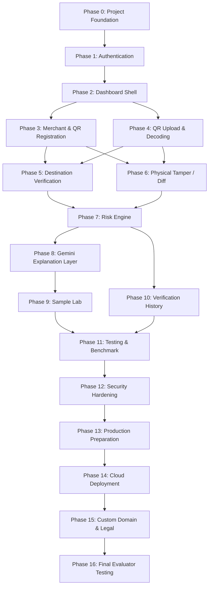

# Development Roadmap & Phase Control: QRShield AI

Status: DRAFT  
Last Updated: 2026-10-04  
Owner: QRShield Project  

---

## 1. Roadmap Overview & Governance

Development of QRShield AI follows a strict linear gate model. Each phase has explicit prerequisites, functional boundaries, deliverables, and completion criteria. 

**Rule of Progression**: No phase may be started until the immediately preceding prerequisite phase has been completely verified and signed off.

---

## 2. Phase Breakdown & Specifications

### Phase 0 — Project Foundation
- **Objective**: Establish project governance, repository structure, strict linting/formatting rules, and base documentation without writing runtime application code.
- **Features**: Workspace directory initialization (`docs/`), environment variable schema templates (`.env.example`), linting configuration.
- **Inputs**: Approved project specifications and rules (`docs/*`).
- **Outputs**: Clean project structure, verified documentation, no code or package installations.
- **Dependencies**: None.
- **Completion Criteria**: 
  - All 5 foundation markdown files exist in `docs/` with zero contradictions.
  - Repository contains zero unapproved source code, zero installed node/python packages, and zero secrets.
- **Strict Prohibition**: DO NOT install packages, write frontend/backend code, configure databases, or create API keys during this phase.

---

### Phase 1 — Authentication
- **Objective**: Implement secure identity management using Supabase Auth for merchant accounts and organization operators.
- **Features**: Merchant sign-up, email/password login, password recovery, session persistence, JWT handling, auth state provider.
- **Inputs**: Supabase project configuration (URL and public anon key).
- **Outputs**: Functional authentication client and protected route wrapper components.
- **Dependencies**: Phase 0.
- **Completion Criteria**: 
  - A merchant can sign up, receive an auth session, log out, and log in.
  - JWT tokens are validated and safely stored in client state.
- **Strict Prohibition**: DO NOT build merchant data tables, file upload handlers, or scanning components.

---

### Phase 2 — Dashboard Shell
- **Objective**: Construct the primary application user interface layout and navigation frame adhering strictly to the design system.
- **Features**: Navigation bar, responsive layout shell, active route indicator, user profile badge, footer, design system token definitions.
- **Inputs**: Design specifications (`docs/design.md`).
- **Outputs**: Interactive application shell with placeholder views for Verify, Sample Lab, Registered Merchants, and History.
- **Dependencies**: Phase 0, Phase 1.
- **Completion Criteria**: 
  - Layout is fully responsive (mobile, tablet, desktop).
  - Adheres strictly to visual rules (no purple gradients, no emojis, clean outline icons).
  - Passes WCAG AA color contrast checks.
- **Strict Prohibition**: DO NOT connect live QR decoding, live database queries, or AI API calls.

---

### Phase 3 — Trusted Merchant / QR Registration
- **Objective**: Enable authenticated merchants to register their business profiles, authorized payment destinations (VPAs/URLs), and baseline reference QR photos.
- **Features**: Merchant profile form, destination registration table, reference QR photo upload with preview, Supabase DB tables (`merchants`, `payment_destinations`, `reference_qrs`) with strict RLS policies.
- **Inputs**: Authenticated merchant session, business data, payment VPAs, reference photos.
- **Outputs**: Securely stored records in Supabase PostgreSQL and reference images in private Supabase Storage bucket.
- **Dependencies**: Phase 1, Phase 2.
- **Completion Criteria**: 
  - Merchant can add, edit, and view their registered payment destinations.
  - Reference QR images upload cleanly to private storage with signed URL access.
  - RLS rules rigorously verified: Merchant A cannot view or edit Merchant B's assets.
- **Strict Prohibition**: DO NOT implement public scanning or AI explanations.

---

### Phase 4 — QR Upload and Decoding
- **Objective**: Implement robust image ingestion and deterministic QR payload decoding for uploaded files and camera streams.
- **Features**: Drag-and-drop file upload zone, camera viewport using `getUserMedia()`, client/server image pre-processing (downsampling, binarization), deterministic QR decoding engine, payment payload parser (UPI URI, standard URLs, raw text).
- **Inputs**: Static image files (`image/jpeg`, `image/png`, `image/webp`) or camera video frames.
- **Outputs**: Extracted raw payload string, parsed destination fields (VPA, payee name, merchant category code), finder pattern coordinate boundaries.
- **Dependencies**: Phase 0, Phase 2.
- **Completion Criteria**: 
  - Successfully decodes standard clear QR images in $< 250\text{ms}$.
  - Returns structured `E_DECODE_FAILED` / `INSUFFICIENT_EVIDENCE` for blurred, corrupted, or non-QR images.
- **Strict Prohibition**: DO NOT execute database lookups, risk scoring, or AI calls.

---

### Phase 5 — Payment Destination Verification
- **Objective**: Build the deterministic logic comparing decoded payment destinations against the registered merchant database.
- **Features**: Exact string normalizer (lowercasing, trimming, URI parameter unescaping), database lookup by VPA or URL, field-level comparison engine.
- **Inputs**: Decoded payload from Phase 4, Supabase database from Phase 3.
- **Outputs**: Destination match status (`MATCH`, `MISMATCH`, `NOT_FOUND`), expected vs actual field diff object.
- **Dependencies**: Phase 3, Phase 4.
- **Completion Criteria**: 
  - 100% test pass rate for exact match, case normalization, and intentional character substitution attacks (e.g. `store@okaxis` vs `store-okaxis@upi`).
- **Strict Prohibition**: DO NOT use fuzzy matching for destination verification. DO NOT call Gemini.

---

### Phase 6 — Physical Tamper / Reference Comparison
- **Objective**: Implement computer vision routines to compare candidate QR scans against stored baseline reference images.
- **Features**: Homographic perspective alignment using finder patterns, Structural Similarity (SSIM) matrix diffing, Canny edge detection for physical sticker overlays and boundary borders.
- **Inputs**: Candidate scan image buffer and registered reference image buffer.
- **Outputs**: Alignment score ($0.0$ to $1.0$), edge anomaly count, visual delta mask.
- **Dependencies**: Phase 3, Phase 4.
- **Completion Criteria**: 
  - Baseline matching image yields alignment score $> 0.90$.
  - Artificially overlaid sticker specimens flag boundary edge anomalies.
- **Strict Prohibition**: DO NOT generate subjective text descriptions; output must be strictly quantitative metrics.

---

### Phase 7 — Risk Engine
- **Objective**: Integrate deterministic destination comparison and visual tamper metrics into a calibrated risk score and canonical status classification.
- **Features**: Rule evaluation engine (`R01_DEST_MATCH` through `R05_POOR_QUALITY`), weighted scoring matrix, canonical status resolver (`VERIFIED`, `DESTINATION_MISMATCH`, `UNVERIFIED`, `SUSPICIOUS`, `INSUFFICIENT_EVIDENCE`).
- **Inputs**: Verification metrics from Phase 5 and Phase 6.
- **Outputs**: Standardized Verification Report data object.
- **Dependencies**: Phase 5, Phase 6.
- **Completion Criteria**: 
  - Deterministic evaluation test suite verifies all 5 canonical statuses across matrix combinations.
- **Strict Prohibition**: DO NOT invoke Gemini to decide the status code.

---

### Phase 8 — Gemini Explanation Layer
- **Objective**: Connect backend to Google Gemini API to synthesize human-readable, factual explanations of the deterministic verification report.
- **Features**: Gemini API integration via official SDK, rigid prompt engineering enforcing neutral/evidentiary tone, structured JSON response schema, automatic fallback to static deterministic templates on API failure/timeout.
- **Inputs**: Verification Report from Phase 7.
- **Outputs**: Concise, neutral narrative explanation for display in the UI.
- **Dependencies**: Phase 7.
- **Completion Criteria**: 
  - Generated explanations describe only verified facts without speculation or defamatory language.
  - Zero application crashes if Gemini API key is missing or service times out.
- **Strict Prohibition**: Gemini must NEVER override deterministic status codes.

---

### Phase 9 — Sample Lab
- **Objective**: Construct an interactive test lab pre-loaded with documented test specimens representing key verification scenarios.
- **Features**: Specimen selection gallery, 6 canonical specimens (Valid, Mismatch, Tampered, Unregistered, Blurred, Damaged), single-click verification runner, ground truth comparison indicators.
- **Inputs**: Curated sample images with ground-truth metadata.
- **Outputs**: Functional Sample Lab view clearly marked with `DEMO / TEST DATA` notices.
- **Dependencies**: Phase 4, Phase 7, Phase 8.
- **Completion Criteria**: 
  - All 6 specimens execute seamlessly and output their expected canonical status.
  - Prominent banner confirms that all samples are synthetic demonstration data.
- **Strict Prohibition**: DO NOT claim samples represent real-world fraud victims.

---

### Phase 10 — Verification History
- **Objective**: Provide an auditable, persistent log of historical verification operations for merchants and authorized users.
- **Features**: PostgreSQL `verification_logs` schema, paginated data table, status filtering, timestamp ordering, detailed log inspection modal.
- **Inputs**: Completed verification transactions.
- **Outputs**: Audit history interface with monospace data display.
- **Dependencies**: Phase 1, Phase 7.
- **Completion Criteria**: 
  - Every completed verification records an immutable log entry.
  - Merchants can inspect their own past verifications with full payload and tamper details.
- **Strict Prohibition**: DO NOT store unmasked financial credentials or unnecessary consumer PII.

---

### Phase 11 — Testing and Benchmark
- **Objective**: Execute end-to-end unit, integration, and benchmark suites to measure actual system performance against documented criteria.
- **Features**: Test runner suite, benchmark evaluation dataset, calculation of decode rate, mismatch precision/recall, and tamper detection metrics.
- **Inputs**: Benchmark test dataset of annotated QR images.
- **Outputs**: Empirical benchmark report containing calculated metrics.
- **Dependencies**: Phases 4 through 10.
- **Completion Criteria**: 
  - All unit and integration tests pass with $> 85\%$ code coverage on core logic.
  - Benchmark report is generated with zero fabricated numbers.
- **Strict Prohibition**: DO NOT display synthetic or unverified percentages in documentation or UI.

---

### Phase 12 — Security Hardening
- **Objective**: Conduct comprehensive vulnerability assessments, input validation audits, and security configuration hardening.
- **Features**: Automated dependency vulnerability audit (`npm audit`), secret exposure scan, CORS validation, rate-limiting verification, RLS bypass testing.
- **Inputs**: Full application codebase and database schema.
- **Outputs**: Hardened configurations and security verification report.
- **Dependencies**: Phase 11.
- **Completion Criteria**: 
  - Zero critical or high severity vulnerabilities in dependencies.
  - Rate limiting actively blocks rapid requests beyond threshold.
  - Cross-tenant RLS access attempts return 0 rows.
- **Strict Prohibition**: DO NOT deploy to production before passing security audit.

---

### Phase 13 — Production Preparation
- **Objective**: Optimize application bundles, finalize production environment variable schemas, set up structured logging, and implement health checks.
- **Features**: Production build pipeline, tree-shaking, asset compression, health check endpoint (`/api/v1/health`), global error boundaries.
- **Inputs**: Hardened codebase.
- **Outputs**: Production release build artifacts and container configurations.
- **Dependencies**: Phase 12.
- **Completion Criteria**: 
  - Production build compiles with zero errors or warnings.
  - Health check endpoint returns valid system telemetry.
- **Strict Prohibition**: DO NOT include development mock data in production builds.

---

### Phase 14 — Vercel/Render/Supabase Deployment
- **Objective**: Deploy the verified frontend to Vercel, the backend to Render, and establish production Supabase database connections.
- **Features**: Cloud deployment configuration, SSL termination, environment variable provisioning, automated deployment webhooks.
- **Inputs**: Release artifacts and production service credentials.
- **Outputs**: Live production frontend and backend services running on cloud infrastructure.
- **Dependencies**: Phase 13.
- **Completion Criteria**: 
  - Live frontend successfully queries live Render backend.
  - Supabase database and storage buckets accept production traffic over TLS 1.3.
- **Strict Prohibition**: DO NOT expose secret keys in client-side environment configs.

---

### Phase 15 — Custom Domain, Favicon, Privacy Policy, Terms
- **Objective**: Finalize domain configuration, branding assets, and legal compliance documentation.
- **Features**: Custom domain mapping with active SSL, professional technical favicon, compliant Privacy Policy (data minimization, ephemeral scanning), Terms of Service (disclaimer of core banking access).
- **Inputs**: Domain DNS records, legal and compliance documents.
- **Outputs**: Fully branded, legally compliant web application.
- **Dependencies**: Phase 14.
- **Completion Criteria**: 
  - Custom domain resolves cleanly with valid HTTPS certificate.
  - Privacy Policy and Terms of Service are publicly accessible.
- **Strict Prohibition**: DO NOT make unsubstantiated legal or financial guarantees in the Terms.

---

### Phase 16 — Final Evaluator Testing
- **Objective**: Conduct end-to-end verification and validation testing with independent evaluators across all user personas and device formats.
- **Features**: End-to-end walkthrough checklist, cross-browser compatibility tests, mobile camera physical scanning tests, evaluator signoff audit.
- **Inputs**: Live production application and evaluator test protocol.
- **Outputs**: Final Evaluator Verification Report.
- **Dependencies**: Phase 15.
- **Completion Criteria**: 
  - All 10 Project Acceptance Criteria verified on live production environment with zero defects.
  - Signoff achieved across consumer, merchant, and sample lab workflows.
- **Strict Prohibition**: DO NOT alter testing results or suppress edge-case failures.
